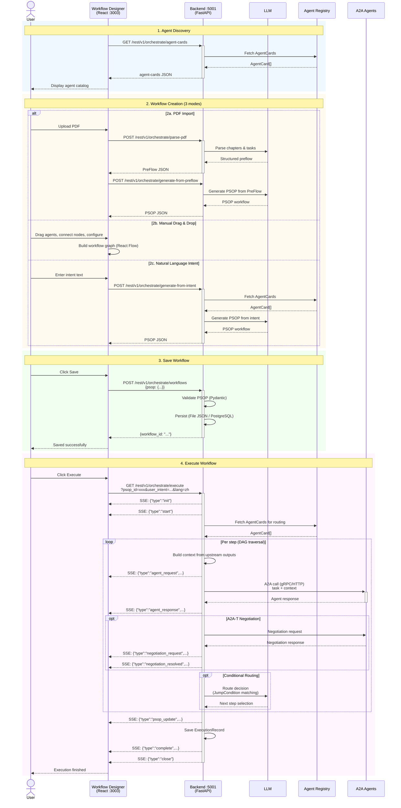
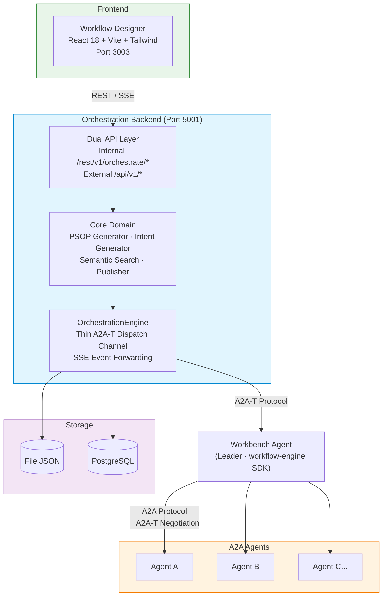

<!--
Copyright (c) 2026 Huawei Technologies Co., Ltd.
All Rights Reserved.

SPDX-License-Identifier: Apache-2.0

   Licensed under the Apache License, Version 2.0 (the "License"); you may
   not use this file except in compliance with the License. You may obtain
   a copy of the License at

        http://www.apache.org/licenses/LICENSE-2.0

   Unless required by applicable law or agreed to in writing, software
   distributed under the License is distributed on an "AS IS" BASIS, WITHOUT
   WARRANTIES OR CONDITIONS OF ANY KIND, either express or implied. See the
   License for the specific language governing permissions and limitations
   under the License.
-->

# A2A-T Multi-Agent Orchestration Center

<p align="center">
  <a href="https://www.python.org/"></a>
  <a href="https://nodejs.org/"></a>
  <a href="LICENSE"></a>
</p>

<p align="center">
  <strong>A visual orchestration platform for multi-agent collaboration via the A2A-T protocol.</strong>
  <br>
  基于 A2A-T 协议的多智能体可视化编排平台。
</p>

<p align="center">
  <a href="./README_zh.md">中文</a>
</p>

---

## Overview

The Orchestration Center is a visual platform for designing and executing multi-agent workflows. It provides a **drag-and-drop workflow designer**, an **async execution engine**, and **A2A-T negotiation** integration — enabling teams to build, manage, and run complex agent collaboration flows without writing code.

**Use cases:** Telecom network assurance workflows, RAN energy-saving orchestration, SPN fault handling pipelines, enterprise multi-agent automation.



## Features

| Category | Capability |
|----------|------------|
| **Visual Designer** | React Flow-based drag-and-drop workflow builder with automatic Dagre layout |
| **Multi-Mode Creation** | PDF document import, manual drag-and-drop, and natural-language-to-workflow via LLM |
| **A2A-T Negotiation** | Fulfillment negotiation between agents via workflow-engine, context carried in Task.metadata |
| **Execution Engine** | `OrchestrationEngine` — thin A2A-T dispatch channel; PSOP workflow execution delegated to the Workbench Agent via workflow-engine SDK |
| **Semantic Search** | Natural-language retrieval of previously built workflows |
| **Dual API Layer** | Internal API (`/rest/v1/orchestrate/*`) for the frontend + External API (`/api/v1/*`) for third-party integration |
| **SSE Streaming** | Real-time execution progress via 11 event types (init, start, agent_request, agent_response, psop_update, negotiation_request, negotiation_resolved, negotiation_failed, complete, error, close) |
| **Pluggable Storage** | File-based JSON or PostgreSQL persistence via HandlerRegistry |
| **Template Marketplace** | Pre-built workflow templates for telecom scenarios (live broadcast, energy saving, fault handling) |
| **Sample Agents** | 10 sample A2A agents with negotiation support for testing and demonstration |

## Quick Start

### Prerequisites

| Component | Requirement |
|-----------|-------------|
| Python | 3.12+ |
| Node.js | 20.19+ |

### Install & Run

```bash
# Clone the repository
git clone https://github.com/project-openan/orchestration-center.git
cd orchestration-center

# Backend setup
python3 -m venv .venv
source .venv/bin/activate      # Linux
# .venv\Scripts\activate       # Windows
pip install -r requirements.txt

# Start backend (port 5001)
python -m orchestrate.start

# Frontend setup (separate terminal)
cd workflow-designer
npm install --force
npm run dev                     # port 3003

# (Optional) Start sample agents
cd ..
python -m samples.start_agents_server
```

### Verify

| Service | Check |
|---------|-------|
| Backend | `Uvicorn running on http://127.0.0.1:5001` |
| Frontend | Open `http://localhost:3003` in browser |
| Sample Agents | Agent startup messages in console |

## Docker Deployment

Orchestration Center is one of three OpenAN components meant to run together
(`orchestration-center`, [`registry-center`](https://github.com/hw-irc-sni/registry-center),
[`prompt-registry`](https://github.com/hw-irc-sni/prompt-registry)), sharing
the `openan-net` Docker network so agent cards resolve by container name.

**One-time setup** (once for all three components, not per-repo):
```bash
docker network create openan-net
```

**Production** — `docker-compose.yml` only:
```bash
docker compose up -d --build
```
Talks to registry-center over HTTPS at `https://openan-registry-center:5000`
(registry-center is HTTPS-by-default in production — see its README). Start
registry-center's stack first, or this container will log connection errors
until that hostname resolves and answers.

This also brings up `workflow-designer`, the containerized frontend: a
multi-stage build (`npm run build`, served by nginx) exposed at
`http://localhost:3003`. nginx reverse-proxies `/api/orchestrate/` to the
`orchestration-center` service on the compose network (matching the
`defaultGateway` the frontend's `src/service/api.js` defaults to), so the
browser never needs a direct route to port 5001 -- keeping frontend and
backend on the same origin, which the session cookie (see Authentication
below) requires. Override the upstream with `BACKEND_HOST`/`BACKEND_PORT`
env vars if you rename or repoint the backend service.

**Development** — layers `docker-compose-dev.yml` on top, which switches
`AGENT_REGISTRY_URL` to plain HTTP to match registry-center's dev stack
(HTTPS disabled there — see that repo's `docker-compose-dev.yml`), and also
brings up a `sample-agents` service (the stub demo agents from
`samples/agentcard/*.json`) so workflow execution has something to call:
```bash
docker compose -f docker-compose.yml -f docker-compose-dev.yml up -d --build
```
`sample-agents` runs the same image with `python3 -m samples.start_agents_server`
and `SAMPLE_AGENTS_HOST=sample-agents`, which makes it advertise and register
its cards under that Compose service name instead of the `127.0.0.1` baked
into the JSON files (only correct when both processes share a host, which
containers don't). It's dev-only and intentionally absent from
`docker-compose.yml` — these are stub agents, not production backends.

> Don't run this `sample-agents` container and a host-run
> `python -m samples.start_agents_server` (`bin/start_samples.sh`) against the
> same registry at the same time — each registers its own card URLs
> (`sample-agents:PORT` vs `127.0.0.1:PORT`) and whichever started last wins,
> silently breaking calls from the other.

Negotiation-capable sample agents need real chat-model credentials to do
anything past startup — `common/config/llm_config.json` ships with a
placeholder API key. Pass `LLM_CHAT_MODEL`/`LLM_CHAT_API_KEY`/`LLM_CHAT_URL`
(host shell or a `.env` next to the compose file) to `sample-agents` for
negotiation to actually work, not just for the container to start green.

Every value in `environment:` reads from the host shell (or a `.env` file
next to the compose file) first, falling back to the default shown in the
file — e.g. `AGENT_REGISTRY_URL=https://a-different-host:5000 docker compose up -d`
overrides it without editing the file.

> Keep the two components on the same "track" — both production files
> together, or both dev files together. Mixing a production
> `registry-center` (HTTPS) with a dev `orchestration-center` pointed at
> `http://` (or vice versa) will fail the TLS handshake.

`prompt-registry` has no wiring to the other two today — join it to
`openan-net` for future integration, but it can be started independently in
any order.

## Architecture



## API Overview

### External API (`/api/v1/*`)

| Method | Endpoint | Description |
|--------|----------|-------------|
| `POST` | `/api/v1/orchestrate/sop` | SOP-based workflow orchestration (JSON text or file upload) |
| `POST` | `/api/v1/orchestrate/intent` | Intent-based workflow orchestration |
| `GET` | `/api/v1/orchestrate/psop/{id}` | Get PSOP workflow detail |
| `POST` | `/api/v1/orchestrate/search` | Search workflows by natural language intent |
| `POST` | `/api/v1/orchestrate/execute` | Auto-orchestrate + execute (SSE streaming) |
| `GET` | `/api/v1/orchestrate/execute/{id}` | Execute a known PSOP (SSE streaming) |
| `GET` | `/api/v1/executions` | List execution records |
| `GET` | `/api/v1/executions/{id}` | Get execution result |

### Internal API (`/rest/v1/orchestrate/*`)

| Method | Endpoint | Description |
|--------|----------|-------------|
| `GET` | `/workflows` | List workflows |
| `GET` | `/workflows/{id}` | Get workflow detail |
| `POST` | `/workflows` | Create workflow |
| `DELETE` | `/workflows/{id}` | Delete workflow |
| `POST` | `/parse-pdf` | Parse PDF SolutionPackage and extract PreFlow |
| `POST` | `/generate-from-preflow` | Generate PSOP from PreFlow |
| `POST` | `/generate-from-intent` | Generate PSOP from intent |
| `POST` | `/retrieve-by-intent` | Retrieve workflow by intent |
| `POST` | `/retrieve-topn-by-intent` | Retrieve top-N workflows by intent |
| `GET` | `/agent-cards` | List available agent cards |
| `GET` | `/templates` | List workflow templates |
| `POST` | `/templates/{id}/import` | Import workflow from template |
| `GET` | `/execute` | Start workflow execution (SSE). Query params: `psop_id`, `user_intent`, `lang` |
| `GET` | `/execution-records` | List execution records |
| `GET` | `/execution-records/{id}` | Get execution record detail |
| `DELETE` | `/execution-records/{id}` | Delete execution record |

Full API specification: [API Reference](docs/en/Orchestration%20Center%20API%20Reference.md)

## Security

The Orchestration Center provides multi-layer access control:

### Frontend Login (Internal API)

The internal API (`/rest/v1/orchestrate/*`) is protected by token-based authentication. Two modes are supported depending on `persistence_mode`:

**Database mode (`persistence_mode=postgresql`)**:
- The plaintext password is sent to the backend (over TLS -- see below) and hashed there with SHA-256 + a per-user salt; the server never persists or compares a client-computed hash.
- A default `admin` user (password: `OpenAN@2026`) is auto-created on first startup.
- New users can self-register via the registration link on the login page.
- Passwords must be at least 8 characters and include at least two of: a digit, an uppercase letter, a lowercase letter, a special character. Enforced server-side (`common/util/password_util.validate_password_complexity`), not just in the UI.

**File mode (`persistence_mode=file`)**:
- A single password is configured via `access_password` in `server.conf`.
- Username is fixed as `admin`.
- Registration is not available.

| Config Key | Description | Default |
|------------|-------------|---------|
| `access_password` | SHA-256 hash of the login password (file mode only). Leave empty to disable auth. | empty (disabled) |
| `access_token_ttl` | Session token lifetime in seconds. | `43200` (12h) |
| `persistence_mode` | `postgresql` enables database-backed user management; `file` uses config-based auth. | `file` |

The frontend sends the password as-is; the backend is what hashes it (server-side, salted, for DB-mode accounts; against the configured SHA-256 in file mode). **This relies on `enable_https=true` for confidentiality in transit** -- see the TLS/HTTPS section below; don't run with the shipped `enable_https=false` default outside local development. The session token is a `Secure` (when `enable_https=true`), `HttpOnly`, `SameSite=Lax` cookie set on login -- it's not readable from JavaScript (mitigates XSS token theft) and the browser attaches it automatically, including on `EventSource`/SSE connections, so it's never carried in a URL or logged as a query param. `Authorization: Bearer <token>` is also accepted as a fallback for non-browser clients (curl, scripts).

A cookie only attaches to a **same-origin** request. Both shipped serving paths -- nginx in front of both in docker-compose, and the Vite dev server's own `/api/orchestrate` proxy for `npm run dev` -- put the frontend and this API on the same origin, so this is transparent. A manually-configured direct-IP deployment (frontend and backend on genuinely different origins) needs `CORS_ORIGINS` set to the frontend's exact origin (not the default `*`, which can't be combined with credentialed requests) for the cookie to work cross-origin at all.

> **Session storage is single-process only.** Tokens live in an in-memory dict inside the running Python process. Running with multiple `uvicorn` workers, or multiple replicas behind a load balancer, will intermittently reject valid tokens -- a token minted by one worker isn't visible to another. Every process restart also logs out all active sessions (harmless in itself given the token TTL, but worth expecting). Both bundled launch paths (`orchestrate/start.py`) run single-process today, so this doesn't bite out of the box -- but if multi-worker or multi-replica deployment is ever needed, session storage must move to a shared backend (e.g. the same PostgreSQL database, or Redis) first.

Generate the password hash (file mode):
```bash
python generate_access_password.py
```

### TLS/HTTPS

| Config Key | Description |
|------------|-------------|
| `enable_https` | Enable HTTPS for the backend server. |
| `verify_client` | Require client certificate (mTLS). Defaults to required when unset or set to anything other than the literal `false`; only an explicit `verify_client=false` in `server.conf` disables it. |
| `ssl_certfile` | Server certificate path. |
| `ssl_keyfile` | Server private key path (encrypted). |
| `ssl_ca_certs` | CA trust store for verifying client certificates. |
| `client_verify_server` | Verify remote server certs on outbound HTTPS calls (e.g., to registry center). Default `false` for backward compat. |

Generate self-signed certificates (RSA 3072, compliant with cert validator):
```bash
python -m generate_selfsign_cert etc/ssl serverAuth
```

New TLS certificates include SANs for `DNS:localhost`, `IP:127.0.0.1` and `IP:::1` by default.
For other endpoints, repeat `--dns` / `--ip` for the actual client-facing names; explicit options replace the default SAN list:

```bash
python -m generate_selfsign_cert etc/ssl-new serverAuth --dns orch.example.test --ip 192.0.2.10
```

SANs must match the host in the client URL; IP addresses require `--ip`. Setting CN or trusting a certificate does not fix missing SANs.
Existing certificates are not updated automatically, and the tool refuses to overwrite certificates or private keys.
For an existing deployment, generate into a new directory, back up and deploy the matching certificate/key pair, then restart.
Update client trust material where required; do not overwrite the CA store used to authenticate clients.
`dataSigning` does not add TLS SANs and rejects CLI SAN options.

**Enabling HTTPS (step by step):**

1. Generate certificates (see above). The script creates `server_RSA.cer` and `server_key_RSA.pem`. Copy to the names expected by `server.conf`:
   ```bash
   cd etc/ssl
   cp server_RSA.cer server.cer
   cp server_key_RSA.pem server_key.pem
   cp server.cer trust.cer
   echo -n "<your-password>" > cert_pwd
   ```

2. Update `etc/conf/server.conf`:
   ```ini
   enable_https=true
   verify_client=true           # mTLS -- clients must present a certificate. Set to
                                 # false only if you understand this leaves the
                                 # external API (see below) with no authentication.
   agent_registry_url=https://127.0.0.1:5000   # if registry center also uses HTTPS
   ```

3. Set `client_verify_server=false` in `etc/conf/server.properties` to skip remote cert verification when connecting to other services with self-signed certs (e.g., registry center).

4. Restart the backend: `python -m orchestrate.start` (or `systemctl restart orchestration-center`)

5. If using Nginx as reverse proxy, update `proxy_pass` to `https://127.0.0.1:5001/` and add `proxy_ssl_verify off;`. Nginx needs an unencrypted private key:
   ```bash
   openssl rsa -in etc/ssl/server_key.pem -out etc/ssl/nginx_key.pem -passin pass:<your-password>
   ```
   Then in nginx.conf: `ssl_certificate_key /path/to/etc/ssl/nginx_key.pem;`

### External API Protection

The external API (`/api/v1/*`) is protected by mTLS at the TLS layer when `enable_https=true` and `verify_client=true`. Clients must present a valid certificate during the TLS handshake -- no application-layer check needed.

**With the shipped `enable_https=false` default, the external API has no protection at all** -- no mTLS (there's no TLS layer to begin with) and no application-layer check (`auth_middleware` only guards the internal API, `/rest/v1/orchestrate/*`, by design). Anything reachable on the network can call it. Don't expose a default (HTTP) deployment beyond local development without a reverse proxy, firewall, or network policy in front of it -- and once you do enable HTTPS, leave `verify_client` at its secure default (`true`) unless you have another authentication layer in place.

### Auth Endpoints

| Method | Endpoint | Description |
|--------|----------|-------------|
| `POST` | `/rest/v1/orchestrate/auth/login` | Login with username + password, sets the session cookie |
| `POST` | `/rest/v1/orchestrate/auth/register` | Register a new user (PostgreSQL mode only) |
| `POST` | `/rest/v1/orchestrate/auth/logout` | Revoke the session token and clear its cookie |
| `GET` | `/rest/v1/orchestrate/auth/check` | Check if auth is required, token validity, and registration availability |
| `GET` | `/rest/v1/orchestrate/auth/users` | List all users (PostgreSQL mode only) |
| `DELETE` | `/rest/v1/orchestrate/auth/users/{username}` | Delete a user (admin cannot be deleted) |

## Configuration
## Configuration

| Config File | Purpose |
|-------------|---------|
| `etc/conf/server.conf` | Server IP, port, TLS certificates, persistence mode, registry URL, access password |
| `etc/conf/server.properties` | TLS versions, ciphers, rate limiting, connection limits, client_verify_server |
| `etc/conf/db_config.json` | PostgreSQL connection settings — gitignored; copy `etc/conf/db_config.json.template` to get started (only needed for `persistence_mode=postgresql`) |
| `common/config/llm_config.json` | LLM/embed/rerank model endpoints (overridable via `LLM_*`, see below) |
| `.env` | Your local overrides — gitignored. Also where the negotiation SDK reads its `A2AT_*` variables directly (see below) |
| `common/config/README_en.md` | LLM configuration guide |
| `generate_selfsign_cert.py` | Self-signed certificate generator (RSA 3072) |
| `common/ssl/client_ssl_context.py` | Client-side SSL context factory for outbound HTTPS |

## LLM configuration

No provider is hardcoded. `common/config/llm_config.json` ships with placeholders and any
OpenAI-compatible service works. Every scalar field can be overridden without touching the JSON,
using `LLM_<CAPABILITY>_<FIELD>` — set it in your environment or in a `.env` at the repo root:

| Variable | Purpose |
|----------|---------|
| `LLM_CHAT_MODEL` | Model name — **required** |
| `LLM_CHAT_API_KEY` | API key — **required** |
| `LLM_CHAT_URL` | Full chat-completions endpoint — **required** |
| `LLM_CHAT_VERIFY_SSL` | `false` to skip TLS verification (self-signed gateways) |
| `LLM_CHAT_ENABLE_THINKING` | Chain-of-thought flag |

`CAPABILITY` is `chat`, `embed`, or `rerank`; `FIELD` is any scalar key of that capability.
Precedence is **environment > `.env` > `llm_config.json`**. Structured fields (`auth`, `headers`,
`body`, `response`) are request templates and stay in the JSON. In Docker only the `LLM_CHAT_*`
variables are forwarded (see `docker-compose.yml`); other capabilities stay JSON-configured there.

This configures the orchestration backend's own LLM calls (intent parsing, PSOP retrieval, PDF
summarization). It is independent of the A2A-T negotiation SDK's configuration below.

```bash
LLM_CHAT_MODEL=gpt-4o
LLM_CHAT_API_KEY=<your-api-key>
LLM_CHAT_URL=https://api.openai.com/v1/chat/completions
```

See [`.env.example`](.env.example) for DeepSeek, Qwen and self-hosted-gateway examples.

## A2A-T SDK Integration

This project integrates the workflow-engine SDK for Workbench Agent workflow execution and agent
fulfillment negotiation. Its configuration (`A2AT_LLM_PROVIDER`, `A2AT_LLM_MODEL`,
`A2AT_LLM_API_KEY`, `A2AT_LLM_BASE_URL`, `A2AT_NEGOTIATION_STATE_STORE_TYPE`, …) is read directly
from the repo-root `.env` — set it there:

```bash
A2AT_LLM_PROVIDER=deepseek
A2AT_LLM_MODEL=deepseek-chat
A2AT_LLM_API_KEY=<your-api-key>
A2AT_LLM_BASE_URL=https://api.deepseek.com
A2AT_NEGOTIATION_STATE_STORE_TYPE=in_memory
```

This is independent of the `LLM_CHAT_*` configuration above — there is no auto-derivation between
the two.

## Documentation

| Document | Description |
|----------|-------------|
| [User Guide](docs/en/Orchestration%20Center%20User%20Guide.md) | Features, scenarios, quick start, FAQ |
| [API Reference](docs/en/Orchestration%20Center%20API%20Reference.md) | Full REST API specification |
| [Developer Guide](docs/en/Orchestration%20Center%20Development%20Guide.md) | Custom handlers, LLM module, extension |
| [GCP Deployment Guide](docs/en/Orchestration%20Center%20GCP%20Containerized%20Deployment%20Guide.md) | Docker + GCP Cloud Run deployment guide |
| [Frontend README](workflow-designer/README.md) | Workflow Designer setup and tech stack |
| [LLM Config](common/config/README_en.md) | LLM configuration reference |

> For Chinese documentation, see [中文 README](README_zh.md) or [docs/zh/](docs/zh/).

## License

This project is licensed under the **Apache License 2.0**. See [LICENSE](LICENSE) for details.
