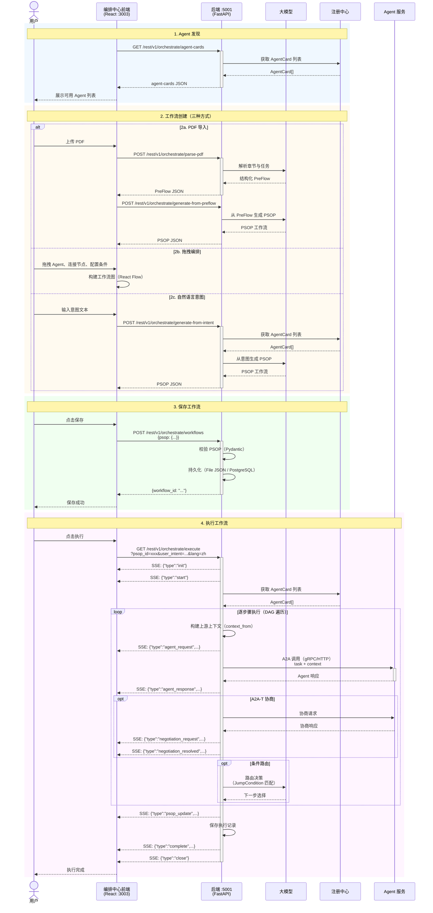
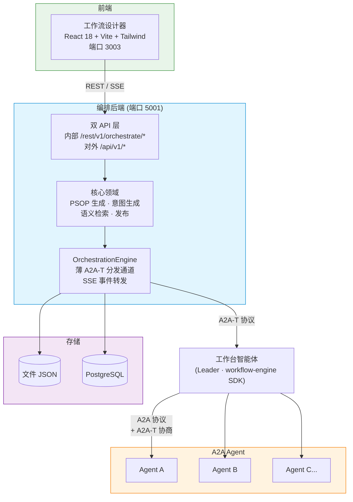

<!--
Copyright (c) 2026 Huawei Technologies Co., Ltd.
All Rights Reserved.

SPDX-License-Identifier: Apache-2.0

   Licensed under the Apache License, Version 2.0 (the "License"); you may
   not use this file except in compliance with the License. You may obtain
   a copy of the License at

        http://www.apache.org/licenses/LICENSE-2.0

   Unless required by applicable law or agreed to in writing, software
   distributed under the License is distributed on an "AS IS" BASIS, WITHOUT
   WARRANTIES OR CONDITIONS OF ANY KIND, either express or implied. See the
   License for the specific language governing permissions and limitations
   under the License.
-->

# A2A-T 多智能体编排中心

<p align="center">
  <a href="https://www.python.org/"></a>
  <a href="https://nodejs.org/"></a>
  <a href="LICENSE"></a>
</p>

<p align="center">
  <strong>基于 A2A-T 协议的多智能体可视化编排平台。</strong>
  <br>
  A visual orchestration platform for multi-agent collaboration via the A2A-T protocol.
</p>

<p align="center">
  <a href="./README.md">English</a>
</p>

---

## 概述

编排中心是一个面向多智能体（Agent）协作的可视化编排平台，提供拖拽式工作流设计器、异步执行引擎和 A2A-T 协商集成。

**典型场景：** 电信网络保障工作流、RAN 节能编排、SPN 故障处理流水线、企业多智能体自动化。



## 核心能力

| 能力 | 说明 |
|------|------|
| **可视化编排** | 基于 React Flow 的拖拽式工作流设计器，支持自动 Dagre 布局 |
| **多模式生成** | 支持 PDF 文档导入、手动拖拽编排、自然语言生成三种工作流创建方式 |
| **A2A-T 协商集成** | 集成 workflow-engine 的 fulfillment 协商能力，协商上下文通过 Task.metadata 携带 |
| **执行引擎** | `OrchestrationEngine` — 薄 A2A-T 分发通道；PSOP 工作流执行委托给工作台智能体（workflow-engine SDK） |
| **语义检索** | 基于自然语言意图检索历史工作流，快速复用已有流程 |
| **双 API 层** | 内部 API（`/rest/v1/orchestrate/*`）供前端调用 + 对外 API（`/api/v1/*`）供第三方集成 |
| **SSE 流式推送** | 11 种事件类型（init、start、agent_request、agent_response、psop_update、negotiation_request、negotiation_resolved、negotiation_failed、complete、error、close）实时推送执行进度 |
| **可插拔存储** | 文件 JSON 或 PostgreSQL 持久化，通过 HandlerRegistry 切换 |
| **模板市场** | 预置电信场景工作流模板（直播保障、节能、故障处理） |
| **示例 Agent** | 10 个示例 A2A Agent，集成协商能力，用于测试和演示 |

## 快速开始

### 环境要求

| 组件 | 版本要求 |
|------|----------|
| Python | 3.12+ |
| Node.js | 20.19+ |

### 安装运行

```bash
# 克隆仓库
git clone https://github.com/project-openan/orchestration-center.git
cd orchestration-center

# 后端启动
python3 -m venv .venv
source .venv/bin/activate      # Linux
# .venv\Scripts\activate       # Windows
pip install -r requirements.txt
python -m orchestrate.start    # 端口 5001

# 前端启动（新终端）
cd workflow-designer
npm install --force
npm run dev                     # 端口 3003

# （可选）启动示例 Agent
cd ..
python -m samples.start_agents_server
```

### 验证

| 服务 | 验证方式 |
|------|----------|
| 后端 | 日志输出 `Uvicorn running on http://127.0.0.1:5001` |
| 前端 | 浏览器访问 `http://localhost:3003` |
| 示例 Agent | 控制台输出各 Agent 启动信息 |

## 架构



## API 概览

### 对外 API (`/api/v1/*`)

| 方法 | 端点 | 说明 |
|------|------|------|
| `POST` | `/api/v1/orchestrate/sop` | SOP 编排（JSON 文本或文件上传） |
| `POST` | `/api/v1/orchestrate/intent` | 意图编排 |
| `GET` | `/api/v1/orchestrate/psop/{id}` | 获取 PSOP 工作流详情 |
| `POST` | `/api/v1/orchestrate/search` | 自然语言语义检索工作流 |
| `POST` | `/api/v1/orchestrate/execute` | 自动编排+执行（SSE 流式推送） |
| `GET` | `/api/v1/orchestrate/execute/{id}` | 执行指定 PSOP（SSE 流式推送） |
| `GET` | `/api/v1/executions` | 查询执行记录列表 |
| `GET` | `/api/v1/executions/{id}` | 查询执行结果 |

### 内部 API (`/rest/v1/orchestrate/*`)

| 方法 | 端点 | 说明 |
|------|------|------|
| `GET` | `/workflows` | 查询工作流列表 |
| `GET` | `/workflows/{id}` | 获取工作流详情 |
| `POST` | `/workflows` | 创建工作流 |
| `DELETE` | `/workflows/{id}` | 删除工作流 |
| `POST` | `/parse-pdf` | 解析 PDF SolutionPackage 提取 PreFlow |
| `POST` | `/generate-from-preflow` | 从 PreFlow 生成 PSOP |
| `POST` | `/generate-from-intent` | 从意图生成 PSOP |
| `POST` | `/retrieve-by-intent` | 按意图检索工作流 |
| `POST` | `/retrieve-topn-by-intent` | 按意图检索 Top-N 工作流 |
| `GET` | `/agent-cards` | 查询可用 Agent 列表 |
| `GET` | `/templates` | 查询工作流模板列表 |
| `POST` | `/templates/{id}/import` | 从模板导入工作流 |
| `GET` | `/execute` | 启动工作流执行（SSE 流式推送），参数：`psop_id`、`user_intent`、`lang` |
| `GET` | `/execution-records` | 查询执行记录列表 |
| `GET` | `/execution-records/{id}` | 获取执行记录详情 |
| `DELETE` | `/execution-records/{id}` | 删除执行记录 |

完整规范：[API 参考](docs/zh/编排中心API参考.md)

## 安全

编排中心提供多层访问控制：

### 前端登录（内部 API）

内部 API（`/rest/v1/orchestrate/*`）受令牌认证保护。根据 `persistence_mode` 支持两种模式：

**数据库模式（`persistence_mode=postgresql`）**：
- 明文密码发送到后端（需经由 TLS，见下文），由后端使用 SHA-256 + 每用户独立 salt 哈希；服务器不再持久化或比对由客户端计算出的哈希值。
- 首次启动自动创建默认 `admin` 用户（密码：`OpenAN@2026`）。
- 新用户可通过登录页的注册链接自行注册。
- 密码要求至少 8 位，且至少包含以下两类字符：数字、大写字母、小写字母、特殊字符。该策略在服务端强制校验（`common/util/password_util.validate_password_complexity`），而不仅仅是前端界面提示。

**文件模式（`persistence_mode=file`）**：
- 通过 `server.conf` 的 `access_password` 配置单一密码。
- 用户名固定为 `admin`。
- 不支持注册。

| 配置项 | 说明 | 默认值 |
|--------|------|--------|
| `access_password` | 登录密码的 SHA-256 哈希值（仅 file 模式）。留空则禁用认证。 | 空（禁用） |
| `access_token_ttl` | 会话令牌有效期（秒）。 | `43200`（12小时） |
| `persistence_mode` | `postgresql` 启用数据库用户管理；`file` 使用配置密码认证。 | `file` |

前端按原样发送密码；由后端负责哈希（数据库模式下按用户加盐哈希；文件模式下与配置的 SHA-256 值比对）。**这依赖 `enable_https=true` 来保证传输过程的机密性**——见下方 TLS/HTTPS 一节；除本地开发外，不要使用默认的 `enable_https=false`。会话令牌以 `Secure`（当 `enable_https=true` 时）、`HttpOnly`、`SameSite=Lax` 的 Cookie 形式在登录时下发——JavaScript 无法读取它（缓解 XSS 窃取令牌的风险），浏览器会自动携带它，包括在 `EventSource`/SSE 连接上，因此它不会出现在 URL 或作为查询参数被记录到日志中。为非浏览器客户端（curl、脚本）保留了 `Authorization: Bearer <token>` 作为后备方式。

Cookie 只会在**同源**请求中被携带。当前提供的两种部署方式——docker-compose 中前后端都在 nginx 之后，以及 `npm run dev` 时 Vite 开发服务器自带的 `/api/orchestrate` 代理——都让前端与本 API 处于同一来源，因此这一点是透明的。若手动配置为直连 IP 部署（前后端确实处于不同源），则需要将 `CORS_ORIGINS` 设置为前端的确切来源（而非默认的 `*`，因为它无法与带凭证的请求组合使用），Cookie 才能跨源生效。

> **会话存储仅限单进程。** 令牌保存在运行中 Python 进程的内存字典中。若以多个 `uvicorn` worker 运行，或在负载均衡后部署多个副本，会间歇性地拒绝本应有效的令牌——因为某个 worker 签发的令牌对其他 worker 不可见。每次进程重启也会导致所有活动会话登出（鉴于令牌本身有 TTL，这本身无害，但仍需提前预期）。当前内置的两条启动路径（`orchestrate/start.py`）都是单进程运行，因此默认情况下不会触发此问题——但如果之后需要多 worker 或多副本部署，必须先将会话存储迁移到共享后端（例如现有的 PostgreSQL 数据库，或 Redis）。

生成密码哈希（file 模式）：
```bash
python generate_access_password.py
```

### TLS/HTTPS

| 配置项 | 说明 |
|--------|------|
| `enable_https` | 启用 HTTPS。 |
| `verify_client` | 要求客户端证书（mTLS 双向认证）。未设置或设置为除字面量 `false` 以外的任何值时，默认要求证书；只有 `server.conf` 中显式写明 `verify_client=false` 才会关闭校验。 |
| `ssl_certfile` | 服务器证书路径。 |
| `ssl_keyfile` | 服务器私钥路径（加密存储）。 |
| `ssl_ca_certs` | CA 信任库，用于校验客户端证书。 |
| `client_verify_server` | 出站 HTTPS 调用（如访问注册中心）时是否校验对端证书。默认 `false`（向后兼容）。 |

生成自签名证书（RSA 3072，满足证书校验要求）：
```bash
python -m generate_selfsign_cert etc/ssl serverAuth
```

新生成的 TLS 证书默认带 SAN：`DNS:localhost`、`IP:127.0.0.1`、`IP:::1`。
部署到其他地址时，用可重复的 `--dns` / `--ip` 指定实际访问地址；显式选项会替换默认 SAN 列表：

```bash
python -m generate_selfsign_cert etc/ssl-new serverAuth --dns orch.example.test --ip 192.0.2.10
```

SAN 必须与客户端 URL 的主机匹配，IP 必须使用 `--ip`，仅设置 CN 或信任证书不能解决 SAN 缺失。
旧证书不会自动更新；工具拒绝覆盖已有证书或私钥。已有部署请在新目录生成，备份并部署匹配的
证书/私钥后重启服务；需要重新分发信任证书的客户端应同步更新。不要覆盖用于校验客户端身份的 CA 信任库。
`dataSigning` 不添加 TLS SAN，也不接受命令行 SAN 选项。

**启用 HTTPS 步骤：**

1. 生成证书（见上方命令），脚本会创建 `server_RSA.cer` 和 `server_key_RSA.pem`。复制为 `server.conf` 期望的文件名：
   ```bash
   cd etc/ssl
   cp server_RSA.cer server.cer
   cp server_key_RSA.pem server_key.pem
   cp server.cer trust.cer
   echo -n "<你的密码>" > cert_pwd
   ```

2. 修改 `etc/conf/server.conf`：
   ```ini
   enable_https=true
   verify_client=true           # mTLS：要求客户端出示证书。仅在你清楚这会让
                                 # 外部 API（见下文）完全没有认证保护时才设为 false
   agent_registry_url=https://127.0.0.1:5000   # 如果注册中心也用了 HTTPS
   ```

3. 在 `etc/conf/server.properties` 中设置 `client_verify_server=false`，跳过对其他服务（如注册中心）的证书校验（自签名证书场景）。

4. 重启后端：`python -m orchestrate.start`（或 `systemctl restart orchestration-center`）

5. 如果使用 Nginx 反向代理，将 `proxy_pass` 改为 `https://127.0.0.1:5001/` 并添加 `proxy_ssl_verify off;`。Nginx 需要未加密的私钥：
   ```bash
   openssl rsa -in etc/ssl/server_key.pem -out etc/ssl/nginx_key.pem -passin pass:<你的密码>
   ```
   然后在 nginx.conf 中：`ssl_certificate_key /path/to/etc/ssl/nginx_key.pem;`

### 外部 API 保护

外部 API（`/api/v1/*`）在 `enable_https=true` 且 `verify_client=true` 时受 mTLS 保护。客户端必须在 TLS 握手阶段出示有效证书，无需应用层额外检查。

**使用默认的 `enable_https=false` 时，外部 API 完全没有保护**——既没有 mTLS（根本不存在 TLS 层），也没有应用层检查（`auth_middleware` 按设计只保护内部 API `/rest/v1/orchestrate/*`）。网络可达的任何请求方都能调用它。除本地开发外，不要在没有反向代理、防火墙或网络策略保护的情况下暴露默认（HTTP）部署；一旦启用 HTTPS，除非你另有应用层认证机制，否则应保持 `verify_client` 处于安全默认值（`true`）。

### 认证接口

| 方法 | 端点 | 说明 |
|------|------|------|
| `POST` | `/rest/v1/orchestrate/auth/login` | 使用用户名 + 密码登录，设置会话 Cookie |
| `POST` | `/rest/v1/orchestrate/auth/register` | 注册新用户（仅 PostgreSQL 模式） |
| `POST` | `/rest/v1/orchestrate/auth/logout` | 撤销会话令牌并清除其 Cookie |
| `GET` | `/rest/v1/orchestrate/auth/check` | 检查认证状态、令牌有效性及注册可用性 |
| `GET` | `/rest/v1/orchestrate/auth/users` | 列出所有用户（仅 PostgreSQL 模式） |
| `DELETE` | `/rest/v1/orchestrate/auth/users/{username}` | 删除用户（admin 不可删除） |


## 配置速查

| 配置文件 | 用途 |
|----------|------|
| `etc/conf/server.conf` | 服务 IP、端口、TLS 证书、持久化模式、注册中心 URL, access password |
| `etc/conf/server.properties` | TLS 版本、密码套件、流控参数、连接限制, client_verify_server |
| `etc/conf/db_config.json` | PostgreSQL 连接配置——已加入 .gitignore；复制 `etc/conf/db_config.json.template` 作为起点（仅 `persistence_mode=postgresql` 时需要） |
| `common/config/llm_config.json` | LLM/Embedding/Rerank 模型端点（可通过 `LLM_*` 覆盖，见下文） |
| `.env` | 本地覆盖配置 — 已加入 gitignore。协商 SDK 也直接从这里读取 `A2AT_*` 变量（见下文） |
| `common/config/README_zh.md` | LLM 配置指南 |

## LLM 配置

无硬编码厂商。`common/config/llm_config.json` 提供占位符，任何兼容 OpenAI 的服务均可使用。
每个标量字段都可以不修改 JSON 直接覆盖，使用 `LLM_<能力>_<字段>` —— 在环境变量或仓库根目录的
`.env` 中设置：

| 变量 | 用途 |
|------|------|
| `LLM_CHAT_MODEL` | 模型名称 — **必填** |
| `LLM_CHAT_API_KEY` | API 密钥 — **必填** |
| `LLM_CHAT_URL` | 完整的 chat-completions 端点 — **必填** |
| `LLM_CHAT_VERIFY_SSL` | 设为 `false` 跳过 TLS 校验（自签名网关） |
| `LLM_CHAT_ENABLE_THINKING` | 思考模式开关 |

`能力` 为 `chat`、`embed` 或 `rerank`；`字段` 为该能力下任意标量字段。优先级为
**环境变量 > `.env` > `llm_config.json`**。结构化字段（`auth`、`headers`、`body`、`response`）
是请求模板，仍保留在 JSON 中。容器内仅透传 `LLM_CHAT_*`（见 `docker-compose.yml`），其他能力
仍通过 JSON 配置。

该配置驱动编排后端自身的 LLM 调用（意图解析、PSOP 检索、PDF 摘要），与下文 A2A-T 协商 SDK 的
配置相互独立。

```bash
LLM_CHAT_MODEL=gpt-4o
LLM_CHAT_API_KEY=<your-api-key>
LLM_CHAT_URL=https://api.openai.com/v1/chat/completions
```

DeepSeek、Qwen 及自建网关的示例参见 [`.env.example`](.env.example)。

## A2A-T SDK 集成

本项目集成了 workflow-engine SDK，用于工作台智能体的工作流执行和 fulfillment 协商。其配置
（`A2AT_LLM_PROVIDER`、`A2AT_LLM_MODEL`、`A2AT_LLM_API_KEY`、`A2AT_LLM_BASE_URL`、
`A2AT_NEGOTIATION_STATE_STORE_TYPE` 等）直接从仓库根目录的 `.env` 读取 — 请在其中配置：

```env
A2AT_LLM_PROVIDER=deepseek
A2AT_LLM_MODEL=deepseek-chat
A2AT_LLM_API_KEY=<your-api-key>
A2AT_LLM_BASE_URL=https://api.deepseek.com
A2AT_NEGOTIATION_STATE_STORE_TYPE=in_memory
```

与上文的 `LLM_CHAT_*` 配置相互独立 — 两者之间没有自动派生关系。

## 文档导航

| 文档 | 说明 |
|------|------|
| [用户指南](docs/zh/用户指南.md) | 特性介绍、使用场景、快速入门、FAQ |
| [API 参考](docs/zh/编排中心API参考.md) | 完整 REST API 规范 |
| [开发指南](docs/zh/开发指南.md) | 自定义处理器、LLM 模块、扩展开发 |
| [GCP 部署指南](docs/zh/编排中心GCP容器化部署指南.md) | Docker + GCP Cloud Run 部署指南 |
| [设计文档](docs/DESIGN.md) | 系统架构与设计 |
| [前端 README](workflow-designer/README.md) | 工作流设计器技术栈与开发 |
| [LLM 配置](common/config/README_zh.md) | LLM 配置文件说明 |

> 英文文档请参见 [docs/en/](docs/en/)。

## 许可证

本项目基于 **Apache License 2.0** 开源协议。详见 [LICENSE](LICENSE)。
